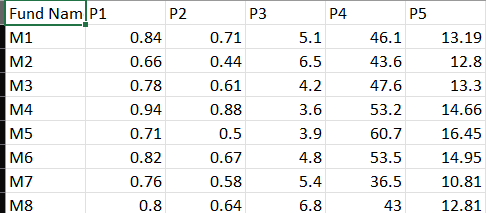
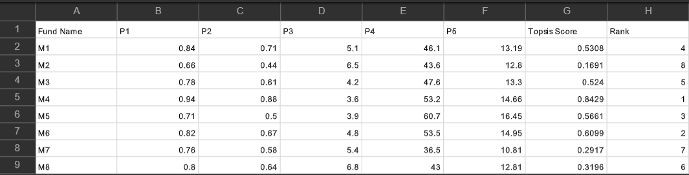
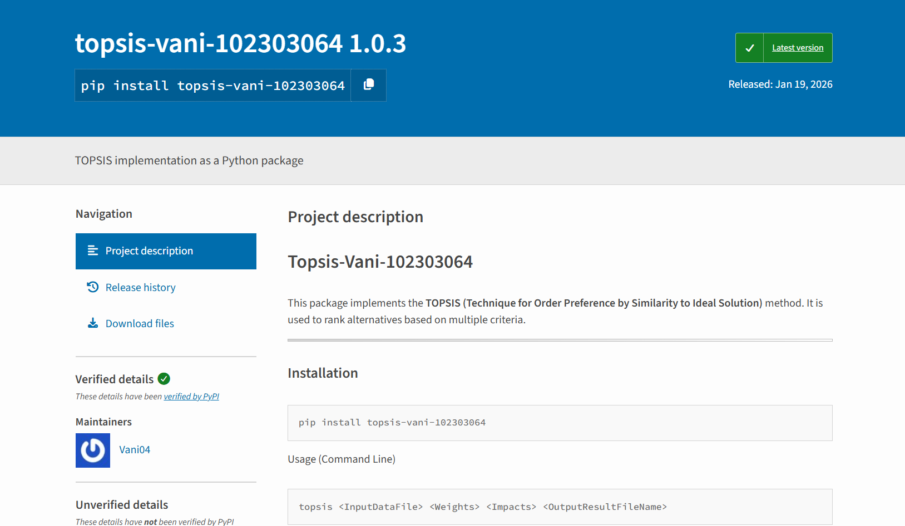
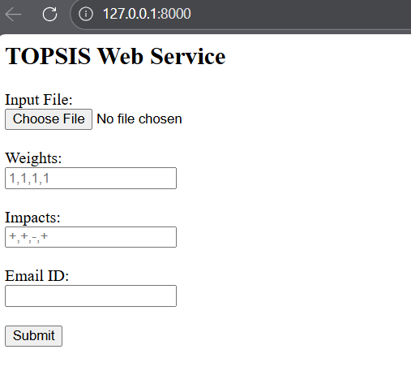

# TOPSIS Assignment

Name: Vani
Roll Number: 102303064

This repository contains the complete implementation of the TOPSIS (Technique for Order Preference by Similarity to Ideal Solution) method as part of the assignment.
All three parts of the assignment are organized clearly in separate folders.

# Part-I: Command Line TOPSIS Implementation
Features
-Implements TOPSIS using Python
-Accepts input via command line
-Validates all inputs as per assignment requirements
-Generates ranked output file

Usage
```bash
python topsis.py data.csv "1,1,1,2" "+,+,-,+" output.csv
```
Validations Included
-Correct number of command-line arguments
-File existence check
-Minimum 3 columns required
-Numeric validation for criteria columns
-Matching number of weights, impacts, and criteria
-Impacts restricted to + or -
-Comma-separated weights and impacts

### 📸 Command Line Execution



# Part-II: PyPI Package
A Python package built and published on PyPI following standard packaging practices.

Installation
```bash
pip install topsis-vani-102303064
```

Command Line Usage
```bash
topsis data.csv "1,1,1,2" "+,+,-,+" output.csv
```

Highlights
-Packaged using setuptools
-Entry point configured for CLI execution
-User manual provided
-Versioned and uploaded to PyPI

### 📸 PyPi Package 


# Part-III: Web Service for TOPSIS
A web-based implementation of TOPSIS using FastAPI.

Features
-Upload CSV/XLSX input file
-Accept weights and impacts
-Email format validation
-Generates TOPSIS result file
-Designed using reusable logic (run_topsis)

Run the Web Service
```bash
python -m uvicorn app:app --reload
```

Access in Browser
```bash
http://127.0.0.1:8000

```

### 📸 Web Service Interface




# Mathematics Behind TOPSIS
TOPSIS ranks alternatives based on:
-Distance from the ideal best solution
-Distance from the ideal worst solution

The alternative closest to the ideal best and farthest from the ideal worst is ranked highest.

# Technologies Used

-Python
-NumPy
-Pandas
-FastAPI
-PyPI
-Git & GitHub